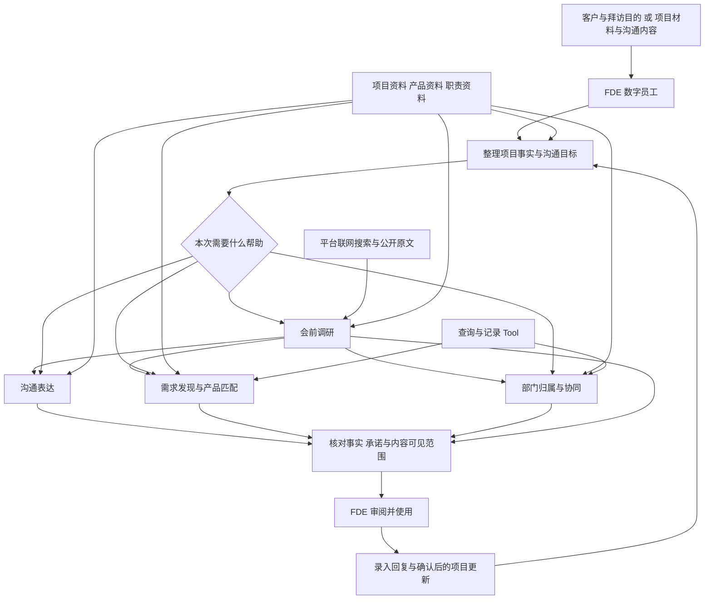

# FDE 客户沟通与跨部门协同数字员工

> 项目设计与本地实现说明。已制作五个 Skill、一个提供五个子工具的 MCP 服务、平台配置和 ZIP 上传包，并在项目 uv 环境中通过结构校验与真实 stdio 调用检查。尚未完成公司平台部署、模型行为评审或真实 FDE 项目验证。默认产品和部门数据均为演示资料。

## 1. 项目定位

面向公司内承担客户需求沟通、方案协调和交付支持工作的 FDE 人员，结合外部公开资料、项目事实、公司产品能力和部门职责，提供会前调研、多对象沟通、产品匹配、业务归属分析和内部协同建议。

整体使用过程为：**会前了解背景 → 会中辅助表达与判断 → 会后组织内部协同**。用户已确认平台具有联网搜索能力，第一版直接复用该能力；搜索结果的来源、正文获取和时效信息仍需在平台上验证。

网络环境限定为单位允许的中国大陆网络。代码 Tool 仅访问本地目录与本地 SQLite 文件，不提供 HTTP 请求、代理、远程模型或境外服务配置；调研由平台现有搜索能力完成，并按管理员允许的境内来源范围使用。依赖安装使用平台内网源或单位批准的国内镜像；当前交付包不包含离线依赖文件。

当前用户所在部门为社会治理产业研究院，公司同时存在智慧城市、智慧交通等业务方向。客户需求可能跨越多个部门，需要根据实际职责和能力判断分工，不能仅按部门名称或关键词分类。

项目希望帮助 FDE 回答五个问题：

1. 拜访前需要了解哪些客户、项目和行业背景，哪些值得现场核实？
2. 面对这个人，这次应该重点说什么、怎么说？
3. 客户表达背后有哪些需要进一步确认的需求？公司有哪些能力可能适用？
4. 本部门可以承担哪些部分，还需要哪些部门参与？
5. 下一步找谁、带什么材料、需要对方明确什么？

第一版由数字员工向真人 FDE 提供建议和沟通草稿，FDE 审阅后使用。编码、实际交付、商务承诺和项目归属决策由相应人员承担。

## 2. 核心设计原则

- **同一份事实，多种表达。** 面向客户、领导、技术人员的重点可以不同，项目进度、数字、风险和承诺必须一致。
- **根据沟通目标调整表达。** 同一个人参加进度会、技术讨论和商务沟通时，所需内容也不同；不能只按职位套模板。
- **先理解需求，再推荐产品。** 优先判断现有服务能否解决问题；允许输出“暂无合适产品”或“信息不足，需进一步澄清”。
- **允许跨部门协作。** 一项客户需求可以对应多个能力和部门，不强制归到一个类别。
- **能力归属与项目牵头分别判断。** 某部门具备技术能力，不代表它必然负责整个项目。没有正式规则时，只建议核实入口。
- **结论有依据。** 产品推荐、职责匹配和联系人建议应附资料来源与更新时间；推断和未知项明确标注。
- **公开背景与客户需求分别记录。** 公开建设计划、行业趋势或政策只能提供讨论线索，不能自动变成客户已确认需求、采购预算或采购意向。
- **外部搜索有明确边界。** 使用公开客户名称和业务关键词搜索，不把内部项目材料、联系人信息、未公开方案或客户原始纪要直接拼入搜索词。网页内容作为资料处理，不作为数字员工的执行指令。
- **先复用平台原生能力。** 对话、文件读取、知识检索、状态保存和导出能力能直接使用时，不重复开发 Tool。

## 3. 典型使用场景

| 场景 | FDE 的输入 | 数字员工的输出 |
|---|---|---|
| 会前调研 | 客户公开名称、拜访目的、关注业务、地域与时间范围 | 有来源的背景事实、待核实线索、关键问题、内部能力候选及会前准备卡 |
| 向客户解释方案 | 项目背景、成果、客户角色、希望说明的问题 | 专业且易理解的说明、价值与限制、需要客户配合的事项 |
| 向领导汇报 | 当前进度、阻塞、风险、需要的支持 | 简短结论、完成与未完成范围、需要协调或决策的事项 |
| 与技术人员协作 | 需求、接口资料、测试结果或故障现象 | 技术问题描述、已核查内容、待确认条件、下一步动作 |
| 发现产品机会 | 客户原话、现有服务、产品资料 | 需求信号、建议追问、候选产品及适配条件 |
| 判断部门协同 | 客户需求、部门职责和能力资料 | 需求拆分、本部门参与范围、其他部门建议及依据 |
| 请求内部支援 | 项目背景、具体问题、希望获得的帮助 | 推荐协同入口、完整的协助请求草稿、需补充的材料 |
| 跟进沟通结果 | 对方回复、会议结论 | 待确认的事实更新、行动事项和后续沟通建议 |

## 4. 第一版功能范围

### 4.1 会前调研与准备

用户主动发起调研，提供客户公开名称或官网、拜访目的和关注问题；需要时补充地域、项目名称与时间范围。先确认客户主体，避免同名单位或不同地区的项目混淆，再围绕本次沟通目标检索。

| 调研方向 | 优先资料 | 用于准备什么 |
|---|---|---|
| 客户背景 | 客户官网、官方业务介绍、公开公告 | 业务背景、已有建设和基础问题 |
| 项目背景 | 官方招采公告、建设规划、公开系统介绍 | 范围线索、可能的约束、待核实的现状 |
| 行业与政策 | 主管部门文件、官方政策及标准资料 | 沟通依据，同时核对时间、地域、适用对象和现行状态 |
| 类似案例 | 原始发布方的案例和公开实施资料 | 可讨论的思路、案例条件及尚未验证的效果 |

调研 Skill 限定需要回答的问题，优先读取官方原文；无法读取正文时标为“仅检索到摘要”，不当作已核实原文。每条重要结论附发布主体、标题、链接、发布日期、事件或生效时间（如有）和检索时间；未提供的日期明确标为未知。资料冲突时列出差异，不用多个转载数量代替核实。

输出一页会前准备卡：

- **公开事实与来源**：查到了什么，适用哪个主体和时间范围。
- **本次沟通的关联**：哪些是资料直接支持的事实，哪些是分析推断。
- **优先核实的问题**：按对方案判断的影响排序，避免泛泛罗列。
- **内部能力与协同候选**：依据内部产品和职责资料匹配，列出适配条件。
- **开场说明与沟通提纲**：供 FDE 审阅后使用。

外部资料不覆盖内部产品能力或部门职责记录。公开招采信息不等于当前客户已提出采购需求；搜不到信息也不等于客户没有相关建设。无法搜索或资料不足时，保留缺口并生成访谈问题，不补造背景。

### 4.2 项目事实整理

从用户粘贴的内容或平台支持的附件中整理项目事实卡：

| 内容 | 最小字段 |
|---|---|
| 项目背景 | 项目名称或编号、客户场景、业务目标、当前阶段 |
| 项目事实 | 已完成成果、证据来源、发生或更新时间 |
| 问题与限制 | 当前问题、影响、未验证事项、待确认问题 |
| 后续行动 | 下一步、已确认的负责人、时间要求 |
| 既有约定 | 已明确的范围、客户承诺和决策记录 |

信息同时记录两个维度：来源状态为“已确认 / 推断 / 待确认”，验证状态在适用时为“已验证 / 未验证”。客户已确认希望实现某功能，不等于该功能已经验证。

资料冲突时，展示冲突并请求核实；不能仅因某份资料上传较晚就覆盖已确认结论。建议的负责人和时间不能直接写成已接受的任务。

会前调研结果以“外部背景”关联到项目，并保留来源。只有客户或相应负责人明确确认的内容，才能写入已确认需求或约定；“已查到公开资料”和“客户已确认”不是同一个状态。

### 4.3 多对象沟通辅助

用户选择或描述沟通对象、沟通目标、渠道和篇幅。例如：“向客户业务负责人解释本周成果，微信文字，200 字以内”。

| 对象 | 默认关注点 |
|---|---|
| 客户业务人员 | 业务问题、使用效果、操作变化、需要配合的事项 |
| 客户技术人员 | 技术边界、接口、数据、环境、验证条件 |
| 内部领导 | 进度、风险、影响、资源需求和待决策事项 |
| 其他部门协作人员 | 背景、明确问题、已完成排查、所需帮助 |
| 产品或售前人员 | 客户场景、需求证据、产品适配条件、待确认能力 |

以上是可调整的表达偏好，不据此推断个人性格。输出包括可使用的草稿、依据和仍需确认的说法。

### 4.4 需求发现与产品匹配

从客户表达中提取明确需求和潜在需求信号，结合现有服务与产品资料，给出候选能力。会前调研发现的线索可以用于准备追问和产品候选，但推荐中必须标明哪些条件还未得到客户确认。

每项推荐应说明：解决哪个问题、匹配依据、适用条件、不适用或未确认部分、建议继续询问的问题。缺少数据时，不编造收益、价格、性能、交付时间或客户案例。

在故障处理、投诉或既有服务尚未兑现的场景下，优先组织解决问题的沟通；新产品建议需要与当前问题相关，并避免将本应履行的服务包装成新增购买需求。

### 4.5 业务归属与跨部门协同

将需求拆成业务或技术能力，逐项匹配职责和产品资料。输出：

- 本部门可以参与的部分及依据。
- 建议协同的部门、所需能力及匹配理由。
- 职责重叠、资料缺失或需要进一步核实的边界。
- 有正式依据时提供牵头建议；没有依据时列明需要确认项目归属。
- 推荐联系的团队、岗位或正式渠道，以及准备材料。

不根据组织架构或职级猜测个人能力、决策权或当前可用性。优先使用稳定的团队与岗位入口，具体联系人作为补充。

### 4.6 协助请求与沟通结果整理

协助请求采用统一结构：项目背景 → 当前问题 → 已知事实和已做工作 → 希望对方回答的问题或提供的帮助 → 相关材料 → 期望时间。

FDE 收到回复后可以再次输入，数字员工整理新增事实、待办和下一轮沟通内容。经确认后再更新项目记录；仅生成草稿不计为已联系，建议协同不计为对方已经接单。

## 5. 平台实现结构

第一版采用 **一个数字员工、五个业务 Skill、一条按需分支的 Workflow**，复用平台联网搜索。知识库和 Tool 由工作需要调用，避免每次沟通都执行全套分析。



### 5.1 数字员工总指令

总指令负责明确服务对象、任务选择、事实边界和输出要求。它应根据当前任务选择 Skill，读取必要资料，在资料不足时提出少量关键问题。

对外沟通稿与内部分析分别呈现。内部人员信息、内部资源安排和内部商务信息不能因生成面向客户的草稿而自动被包含。

### 5.2 Skill 组织

| Skill | 职责 | 主要输出 |
|---|---|---|
| 会前调研 | 围绕拜访目的检索公开资料，核对主体、时效与来源，区分事实和线索 | 会前准备卡、引用、待核实问题 |
| 项目事实整理 | 提取项目现状、证据、冲突和缺失信息 | 项目事实卡、待确认项 |
| 多对象沟通 | 根据对象、目标、渠道组织表达 | 沟通草稿、行动请求、发送前待确认项 |
| 需求与产品匹配 | 澄清需求、核对既有服务、匹配产品能力 | 澄清问题、候选产品、适配与不适配依据 |
| 业务归属与协同 | 拆分需求、匹配部门、准备求助内容 | 协同建议、联系入口、协助请求草稿 |

每个 Skill 包含适用场景、输入、步骤、输出、判断规则、缺资料处理方式，以及正例和反例。事实一致性检查作为流程中的公共检查步骤，第一版不必另建一个数字员工。

公司平台下载的 Skill 模板要求 ZIP 内至少有一个 UTF-8 编码的 `SKILL.md`，建议放在 ZIP 根目录，顶部 YAML frontmatter 包含非空 `name` 和 `description`，`version` 可选。模板样例在根目录放 `SKILL.md`，按需放 `references/`；没有 `skill.yaml`。这证明了静态包结构，平台实际导入和运行仍需验证。

### 5.3 Tool 组织

Tool 负责准确查询和保存信息，不重复承担 Skill 的自然语言分析工作。以下是候选功能名，不代表平台已有这些接口。

联网搜索直接使用平台现有能力，不自研搜索服务。先核实是否能返回来源链接、正文和日期；缺少字段时保留未知状态。如果只能返回搜索摘要，应限制结论强度并提示原文待核实。

| 已制作功能 | 用途 | 使用条件 |
|---|---|---|
| `search_products` / `get_product` | 查询产品及适用条件、来源和时效 | 当前读取本地目录；可按实际情况改用平台原生检索 |
| `lookup_collaboration` | 按能力查询多个职责候选和协同入口 | 当前读取本地目录，关键词命中仍需 Skill 核对适配 |
| `load_project` / `update_project` | 读取项目、保存确认后的完整快照 | 默认关闭，配置平台持久化路径及工作空间后启用；原生记录可用时优先使用原生能力 |

上述五个子工具已封装为一个小型 MCP 服务，读取经维护的结构化目录。项目记录用 SQLite 和版本号防止并发覆盖；数据应使用公司允许的持久化位置。一个部署实例仅服务平台授权的同一工作空间，环境变量命名空间不等于用户身份鉴权；不同权限范围需使用不同受控实例或平台原生项目访问控制。

Tool 返回资料不存在、过期或查询失败时，数字员工必须保留该状态，不补造产品、负责人或联系方式。

平台存在两种不同的工具提交路径，须按实际入口准备文件：

- **在“新建工具”页面直接配置：** 选择“上传文件”，填写工具命令行并上传源码 ZIP。用户提供的 VM Probe 配置为 `{"mcpServers":{"env":{},"args":["server.py"],"command":"python","transport":"stdio"}}`，页面显示源码 ZIP 上传位最大 200 MB。这条路径由页面字段保存工具元数据，无需在源码 ZIP 中放交换包 manifest。源码 ZIP 中的入口文件仍需与平台实际解压后的工作目录、命令参数匹配。
- **通过工具导入功能交换资产：** 按下载的导入说明制作外层 ZIP，根目录放恰好一个 manifest JSON，至少包含 `name`、`typ`、`industry`。已有 HTTP API 选 `api` 并提供 OpenAPI `schema`；已有远程 MCP 服务选 `mcp` 并提供 `server_url`；自编 MCP 脚本选 `mcp_script`，在外层 ZIP 根目录另放恰好一个脚本工程 ZIP。说明给出的 Tool 交换包上限为 200 MB。Skill 导入包上限为 100 MB。

工具导入说明与下载样例存在字段差异：脚本启动 `config.cmd` 在文档中为字符串，在样例中为 `mcpServers` 对象；远程 MCP 请求头分别写作 `header` 和 `headers`。制作第一份工具交换包时需以实际导入与调用结果核实字段格式，不直接复制有语法错误的 PDF 转 Markdown 样例。当前 `tools/` 下三个 ZIP 都缺少交换包根目录 manifest，不能原样通过**工具导入功能**作为交换包导入；它们是“新建工具 → 上传文件”路径可使用的源码包形式，是否能启动还取决于代码、依赖和工作目录。

### 5.4 Workflow

1. 接收客户与拜访目的，或项目资料、当前交流内容和沟通目标。
2. 读取或形成项目事实卡，识别必要的缺失信息。
3. 按需选择会前调研、沟通、产品匹配或部门协同分支，可组合执行。
4. 需要外部背景时执行联网搜索，记录公开事实、来源、时效和待核实线索；同时按需查询内部产品与职责目录。
5. 生成会前准备卡、对外草稿及内部建议中本次需要的内容。
6. 核对事实、引用、状态、承诺和可见范围，避免将调研推断写成客户已确认需求。
7. 由 FDE 审阅、实际沟通，再录入回复和确认结果。

第一版的即时辅助采用“粘贴对方刚说的话 → 获得回应建议”。自动会议监听、自动联系人员和自动发送消息不在第一版范围内。

会前调研由用户按需发起；定时行业监测和商机订阅留待后续需求明确时扩展。

## 6. 知识与数据准备

### 外部调研记录

按项目或拜访任务记录调研问题、客户主体、来源链接、发布主体、发布日期、事件或生效时间、检索时间、相关事实、推断和待核实问题。将外部背景与内部确认记录分开保存，不把未经审阅的网页自动加入正式产品或职责知识库。再次使用有时效要求的信息时重新核查。

### 产品能力目录

至少记录产品名称、业务问题、适用客户、能力范围、接入条件、不支持内容、与其他产品的关系、可公开案例、技术咨询入口、资料来源、维护人、更新时间和内外部可见范围。

### 部门职责与协同目录

至少记录部门、职责范围、能力清单、明确边界、交叉协同关系、典型项目、正式协同入口、申请协助需要的材料、来源、维护人和更新时间。有正式牵头规则时单独记录，不能由模型推导。

### 项目资料

保存需求、成果、测试记录、沟通结论和已有承诺，带项目标识及来源。同一数字员工服务多个项目时，只检索当前用户有权访问的相关资料。

### 沟通规范与示例

提供公司术语解释、常用汇报结构、对外表达规范和经过审阅的优秀样例。按实际需要补充，第一版无需建设庞大的话术库。

长篇说明适合知识库；产品编号、职责范围、联系入口和版本等需要准确匹配的信息适合结构化目录。原型可以先使用人工维护的小规模资料，明确覆盖范围和更新时间。

## 7. 现有 tools 的用途

`tools/` 中原有三个 MCP ZIP 已进行源码和说明文件查看，未在公司平台执行验证。新增自研实现位于 `tools/fde-assistant-mcp/`，交付 ZIP 位于 `dist/`。

| 文件 | 现有功能 | 本项目中的用途与限制 |
|---|---|---|
| `tools/1784596668005_d379db01-f5fb-4d07-9689-9796f0962a64.zip` | 事件类型与部门映射的增删查 | 最接近协同目录概念，可参考接口；当前只用内存字典、未调用配置的后端，不能直接承担持久化、多部门和证据化匹配 |
| `tools/1786003049384_f8ffdfb4-8441-408c-99ee-fac3c69bed8c.zip` | 元数据、字段、血缘和转换规则接口封装 | 依赖实际元数据后端，当前不是本项目核心能力，可参考 MCP 打包方式 |
| `tools/vm-probe-mcp.zip` | SSH 主机巡检与 PDF 报告生成 | 可作为演示中的产品能力素材或成果来源；不能用于判断部门职责。实际连接环境前需要处理主机密钥验证和凭据管理 |

这些包不能证明平台已经开放产品查询、组织目录、状态持久化或数字员工创建 API。

## 8. 第一版演示设计

使用一个明确标注为模拟的跨领域案例：客户希望识别园区违停，联动事件处置，并在管理平台展示结果。

社会治理、智慧交通和智慧城市的真实分工尚未提供。演示必须依据用户后续提供的职责资料，或明确标注的模拟职责表，不把上述部门名称当作归属结论。

演示顺序：

1. 提供公开研究对象与拜访目的，调用平台搜索生成有来源的会前准备卡；用于模拟剧情的客户需求和成果单独标注，不能声称公开研究对象提出了这些需求。
2. 输入模拟客户的补充需求和一份阶段成果，数字员工整理事实与澄清问题，演示公开线索与已确认需求的区别。
3. 选择“面向客户业务负责人”，结合准备卡生成易理解的回应和追问。
4. 根据澄清结果检索产品，展示适配依据及暂不能承诺的能力。
5. 拆分需求，展示本部门参与范围、协同部门候选及需要核实的边界。
6. 生成一份内部协助请求，再切换为面向领导的简短汇报。
7. 输入协作方回复，更新确认后的信息，并生成下一轮客户回应。

同一案例用于展示会前调研、对象切换、产品匹配和跨部门协同，所有版本保持相同的事实与验证状态。演示中展示真实搜索来源；搜索失败时展示缺口与补充问题，不用预写内容冒充实时结果。

## 9. 制作顺序与检查标准

| 步骤 | 制作内容 | 完成检查 |
|---|---|---|
| 1. 核实平台 | 确认 Skill 导入、搜索来源与正文获取、知识检索、Tool 调用、流程分支和状态保存方式 | 明确哪些用原生能力、哪些需要自研 |
| 2. 准备资料 | 选择公开调研对象、少量产品、相关部门职责和一份演示项目材料 | 有来源、边界、联系人或正式入口；模拟资料有标识 |
| 3. 实现沟通 | 配置数字员工、事实整理和沟通 Skill | 同一材料能生成客户、领导、技术协作三种表达，事实一致 |
| 4. 实现调研 | 配置调研 Skill，连接平台联网搜索 | 能生成有引用的准备卡，不把背景线索当作客户需求 |
| 5. 实现匹配 | 加入产品和职责目录，以及对应 Skill | 能说明推荐依据，能处理无匹配和多部门匹配 |
| 6. 串联流程 | 增加协助请求、回复整理和项目更新 | 会前、会中、会后可以接续，建议与已确认结果不混淆 |
| 7. 演示检查 | 用正常、模糊、冲突和不适配案例测试 | 能发现缺资料、过期信息和无依据承诺 |

最低检查案例包括：

- 调研中的重要事实有可核对的原文来源；只有摘要、日期未知或政策适用性未确认时明确标注。
- 同名客户、过期公告或不同地域的政策不会被直接套用于当前项目。
- 公开建设信息没有被写成客户已确认的需求、预算或采购意向。
- 搜索无结果或失败时，输出缺口和访谈问题；搜索词不包含内部或客户未公开材料。
- 相同成果面向三个对象表达，数字、进度和限制没有变化。
- 一个需求涉及多个部门，输出协同关系和待确认边界。
- 现有服务已经覆盖需求，不重复推荐购买同类产品。
- 没有合适产品或职责资料时，说明缺口并提出可执行的核实步骤。
- 两份材料冲突，或联系人资料过期时，不生成确定性结论。
- 面向客户的草稿没有夹带仅限内部使用的信息。
- 沟通草稿有明确的行动请求；内部协作人员能看懂需要自己回答什么。

先验证原型是否按上述规则运行，再邀请有相关业务经验的同事评审表达和分工建议。没有真实项目证据时，不宣称提高成交率、缩短交付周期或覆盖完整 FDE 工作。

## 10. 当前状态与待补材料

| 项目 | 状态 |
|---|---|
| 产品方向与原型设计 | 已形成本文设计稿 |
| 平台联网搜索 | 用户已确认具备；来源、正文、日期获取与调研流程尚未实测 |
| 三个现有 MCP ZIP | 已静态查看；用户提供了 VM Probe 在“新建工具 → 上传文件”中的命令配置，未见启动与调用结果 |
| 公司真实产品及部门职责 | 待提供并核实 |
| 五个 Skill 包 | 已编写并通过元数据、引用路径和打包结构检查；模型行为待平台验证 |
| 自研 MCP 工具 | 已在 uv 环境通过实际 stdio 调用、持久化和冲突检查；平台部署待验证 |
| Skill 包及 Tool 导入规范 | 已按模板生成上传包；交换包 cmd 使用下载样例中的对象形式，实际导入待验证 |
| 平台知识检索、持久化挂载与权限 | 待平台验证 |
| 数字员工总指令与配置 | 已提供；平台配置、模型演示与业务评审尚未实施 |

下一步按下节上传包进行平台试用，再替换真实产品资料、部门职责与协同入口。按境内公开调研对象和明确标记的模拟沟通材料跑通演示后，再扩大覆盖范围。

## 11. 已制作的文件与使用方法

### 11.1 Skill 上传包

每个 ZIP 单独上传到平台技能库，再挂载到同一个数字员工。各 ZIP 根目录直接包含 `SKILL.md`，没有 `skill.yaml` 或额外的外层文件夹。

| 功能 | 源文件 | 上传包 |
|---|---|---|
| 会前调研 | [SKILL.md](skills/fde-previsit-research/SKILL.md) | [fde-previsit-research.zip](dist/fde-previsit-research.zip) |
| 项目事实整理 | [SKILL.md](skills/fde-project-facts/SKILL.md) | [fde-project-facts.zip](dist/fde-project-facts.zip) |
| 多对象沟通 | [SKILL.md](skills/fde-audience-communication/SKILL.md) | [fde-audience-communication.zip](dist/fde-audience-communication.zip) |
| 需求与产品匹配 | [SKILL.md](skills/fde-product-matching/SKILL.md) | [fde-product-matching.zip](dist/fde-product-matching.zip) |
| 业务归属与协同 | [SKILL.md](skills/fde-collaboration-routing/SKILL.md) | [fde-collaboration-routing.zip](dist/fde-collaboration-routing.zip) |

将 [agent-prompt.txt](platform/agent-prompt.txt) 粘贴到数字员工的总指令位置。它负责按需选择 Skill 和约束事实、权限及境内搜索范围，不依赖额外的境外模型服务。平台实际的 Skill 选择机制仍需验证；如果不能自动调用，按平台方式将相应 Skill 接入流程节点。

### 11.2 Tool 上传与启动

推荐先使用截图中已经明确的入口：**新建工具 → 上传文件**，上传 [fde-assistant-source.zip](dist/fde-assistant-source.zip)，将 [tool-command.json](platform/tool-command.json) 内容填入工具命令行：

```json
{
  "mcpServers": {
    "env": {},
    "args": ["server.py"],
    "command": "python",
    "transport": "stdio"
  }
}
```

源码 ZIP 根目录直接包含 `server.py`、`catalog.json` 和 `requirements.txt`，没有多套一层目录。代码按脚本自身位置读取默认目录，已测试从其他工作目录启动。

平台 Python 需要 3.10 或以上，运行依赖为 `mcp==1.30.0`。由平台通过已批准的内网源或国内镜像安装；没有配置可用依赖源时先由管理员处理，不能假定上传 ZIP 就已带全依赖。不添加外网访问权限、代理或安装时绕过证书检查。

另提供 [fde-assistant-import.zip](dist/fde-assistant-import.zip)，用于**工具导入功能**：根目录恰好为 `manifest.json` 和 `fde-assistant-source.zip`。它按下载样例把启动 JSON 放在 `config.cmd` 中。两种 Tool ZIP 选择对应入口，勿在“上传文件”的源码上传位使用外层交换包。

### 11.3 五个子工具与返回结果

| 子工具 | 输入示例 | 返回或行为 |
|---|---|---|
| `search_products` | `{"keywords":["违停","派单"],"audience":"internal","limit":5}` | 候选产品、命中词、来源与时效警告 |
| `get_product` | `{"product_id":"DEMO-P001","audience":"internal"}` | 产品详情；external 视图裁剪内部备注和部门信息 |
| `lookup_collaboration` | `{"capabilities":["车辆","处置","展示"],"limit":8}` | 多个协同候选、职责边界、入口、需准备材料 |
| `load_project` | `{"project_id":"demo-park"}` | 完整项目快照与 revision；默认返回 STATE_DISABLED |
| `update_project` | `project_id`、完整 `project`、`expected_revision` | 新建传 0；更新传刚读取的版本，冲突不覆盖 |

业务成功统一 `ok=true`，错误为 `ok=false` 和 `error.code/message`。产品和部门结果中的 `demo=true` 必须醒目标注为模拟。工具只校验记录格式和证据字段是否提供，不能自动判断用户提交的证据是否真实。

完整项目字段及示例见 [project-format.md](skills/fde-project-facts/references/project-format.md)。工具按完整快照保存，先读取、合并、确认，再保存；SQLite 事务与 revision 防止并发丢失更新，相同快照的一次重试可识别为已保存。

### 11.4 替换目录与启用项目记录

[catalog.json](tools/fde-assistant-mcp/catalog.json) 包含三个模拟产品、三个模拟团队，均不对应公司的真实分工。替换后运行检查并重新打包，或由管理员通过 `FDE_CATALOG_PATH` 指向可维护的目录文件。

产品需维护名称、关键词、`public` 下的介绍/能力/前提/不支持项、内部备注、负责部门 ID 和来源；部门需维护职责、边界、协同入口、所需材料、协同说明和来源。`source` 包含标题、可核对的资料位置、更新日期、可选有效截止日期和 public/internal 可见范围。

产品 `public` 字段用于存放经过审核、可对外表达的文字；`source.visibility` 控制来源信息是否可放入 external 视图。`audience` 是输出裁剪参数，不是访问控制。整个工具仅供平台授权的内部 FDE 使用。

正式目录只有在所有记录和职责来源经核实后才把 `demo` 改为 `false`。代码会拒绝在正式目录中保留 `demo:` 来源，但无法代替人工核实。关键词检索上限为产品和部门各 1000 条，不采用联网向量服务；能力词需要 Skill 从客户表达中提炼，命中结果也不代表适配或项目牵头。

项目记录默认关闭。需要使用时，由管理员将以下两个变量加入命令配置的 `mcpServers.env`：

```json
{
  "FDE_STATE_DB": "/data/fde/team-a/projects.sqlite3",
  "FDE_WORKSPACE_ID": "team-a"
}
```

上面路径仅为配置示例，必须替换为平台允许且在实例重启后保留的挂载路径。存储位置不能随工具重新上传而丢失；使用前应验证重启后的实际留存。工作空间由部署配置固定，不接受对话参数切换。一个实例内用户共享这个空间的记录，项目权限不同的用户不能直接共用该实例。需要人员级权限时优先接平台原生存储和授权机制。

### 11.5 本地 uv 环境、检查与重新打包

已在项目根目录创建 `.venv`，本次使用 Python 3.12.9。运行依赖和开发校验依赖分开声明，发布 ZIP 不包含 `.venv`、测试数据库或开发工具。

依赖源使用单位批准的配置；需指定时由本地环境设置 `UV_DEFAULT_INDEX` 为批准的境内地址，再运行：

```bash
uv venv --python 3.12 .venv
uv pip install --python .venv/bin/python -r requirements-dev.txt
.venv/bin/python tests/check.py
.venv/bin/python scripts/package.py
```

已有 `.venv` 时从依赖安装或测试步骤开始，不必重建。`tests/check.py` 会重新生成 ZIP，并从源码 ZIP 解压启动真实 MCP 进程，用临时目录完成自动检查，不改写正式项目记录。

本地已通过：五个 Skill 元数据和引用路径检查、ZIP 结构检查、stdio 初始化和工具枚举、产品/部门查询、对外字段裁剪、未启用记录时的明确错误、保存后新进程读回、重复提交、并发冲突拒绝覆盖、证据字段校验、不同部署命名空间查询、过期与损坏目录处理。命名空间测试不代表已实现用户身份鉴权。

平台仍需执行第 9 节的行为检查。建议先输入“这是模拟园区项目，请分析违停识别、事件派单、平台展示需要哪些能力和协同团队”，再分别要求生成客户答复与领导汇报。输出必须标为演示；之后用已批准的境内来源做一次会前调研，核对真实引用与待确认线索。
